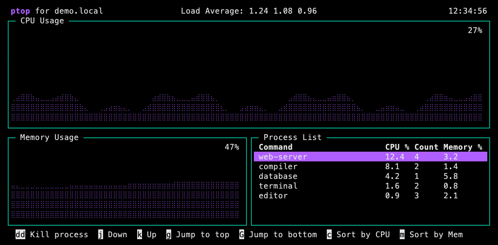

# ptop — Pate's top

A copy of [vtop](https://github.com/MrRio/vtop), rewritten in Rust.

I like vtop. I just wanted a more performant version that works exactly the same,
so I built **ptop**, short for **Pate's top**. Same idea: dotted CPU and memory
history, the process list, familiar controls, and all 12 themes. Rust under the hood.

Matching vtop's look and behavior is the goal. The intentional differences are
ptop branding, a link-free footer, and manual updates; see
[compatibility and measurement](#compatibility-and-measurement) for the tested
coverage and remaining limits.



*Preview rendered by ptop from synthetic demonstration data. Font appearance
depends on your terminal.*

- CPU and memory history in a compact terminal view.
- Process grouping, CPU/memory sorting, and keyboard or mouse navigation.
- Twelve bundled themes, with no runtime asset downloads.
- Native execution and explicit, manual updates.

The npm package supports **Apple Silicon macOS 15 or later**. The package
runs the native executable directly—no resident Node wrapper, install-time
download, or Rust toolchain required. Intel Macs, Linux, and Windows are not
included in this npm release.

## Install and run

```sh
npm install -g @patebryant/ptop
ptop
```

Press **q** to quit. Other examples:

```sh
ptop -t nord
ptop --no-mouse
ptop --fix
```

Ptop uses its own name and a link-free footer. Sensor arithmetic retains vtop's
compatibility behavior by default; `--fix` corrects its macOS memory arithmetic.
The native binary bundles all themes and works independently of this checkout.

## Controls

- `j` / `k`: move selection; `g` / `G`: first / last process.
- `c` / `m`: sort by CPU / memory.
- `h` / `l`: change graph zoom.
- `Ctrl-d`: half-page down; `Ctrl-b` / `Ctrl-f`: page up / down.
- `H` / `M` / `L`: top / middle / bottom of the visible list.
- Mouse click: select; wheel: move two rows.
- `dd`: terminate the selected command's processes, as in vtop.
- `u` / `Ctrl-u`: exit cleanly and show the manual npm update command.

Normal ptop never checks npm in the background and never invokes sudo to update.
Run `npm install -g @patebryant/ptop` when you want to update it.

## Build and verify

Use Rust 1.92.0 for release builds, plus Node 22+ and Python 3 for the test harness.

```sh
cargo build --locked --release
./target/release/ptop
cargo fmt --all -- --check
cargo clippy --all-targets -- -D warnings
cargo test --locked
npm test
```

`npm test` builds and packs the native executable, inspects the actual archive,
installs it into a temporary prefix, checks its hash and permissions, and tests
its installed terminal behavior. `npm pack` creates the release tarball. Package
contents are restricted to the executable, manifest, README, referenced docs/image,
and licenses.

## Compatibility and measurement

The reference is vtop 0.6.1. Ninety fixture frames are compared against the actual
upstream renderer; one additional frame checks ptop branding. CLI, input,
sensor timing, live color-state replay, terminal restoration, and updater tests
provide separate evidence. This is finite test coverage, not a universal visual
or performance guarantee.

`--vtop-parity` is an explicit reference-testing mode. It restores the predecessor
name, footer and updater, including its npm/sudo behavior on the update key.
Use normal ptop for the native package experience.

Use the [benchmark instructions](docs/BENCHMARKING.md) to compare equal workloads
on your machine. CPU measurements include reaped sensor children; sampled RSS
is the monitor's own memory, not total process-tree memory.

[Published 0.1.0 results](docs/PERFORMANCE-NPM-0.1.0.md) include three matched
pairs, per-run variability, and the complete measurement data.

[Historical results](docs/PERFORMANCE-2026-10-06.md) record an earlier binary and
are not performance claims for the current release. Rust alone does not establish
a speedup; terminal size, process count, update interval, and host load matter.

## Credits and license

MIT licensed. Ptop adapts behavior and themes from
[vtop](https://github.com/MrRio/vtop), with rendering conventions from
[blessed](https://github.com/chjj/blessed) and drawille. Original copyright
notices, Unicode notices, Rust dependency licenses, and standard-library notices
are included in `licenses/` and in the npm package.
